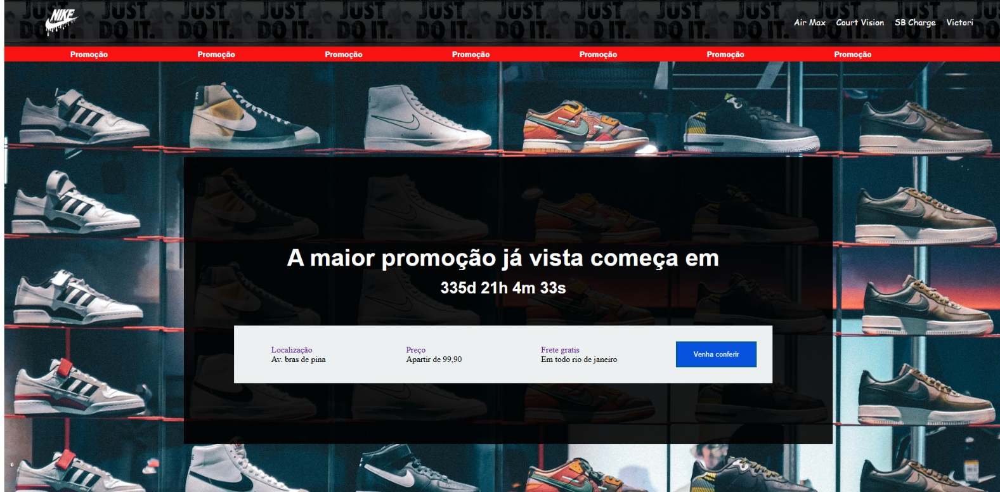

# 👟 Nike Promo

<div align="center">

### 🏷️ Landing Page Promocional

**Projeto de Desenvolvimento Web focado na criação de uma página promocional inspirada em uma loja Nike.**


</div>

---

## 📸 Preview

<div align="center">



</div>

> *Adicione uma captura de tela atualizada do projeto neste local.*

---

## 💻 Sobre o projeto

O **Nike Promo** é uma landing page desenvolvida durante minha jornada de aprendizado em **Desenvolvimento Web / Front-end**.

O projeto apresenta uma página promocional com navegação por categorias, informações sobre preço, localização e frete, além de um **contador regressivo desenvolvido com JavaScript**.

A estrutura utiliza **HTML5**, **SCSS/Sass** e **JavaScript**, com o **Parcel** responsável pelo ambiente de desenvolvimento e processo de build.


---

## ✨ Funcionalidades

* 👟 Navegação entre categorias de produtos;
* 🔴 Área de destaque para promoção;
* ⏱️ Contador regressivo;
* 📍 Exibição de localização;
* 💰 Informações de preço;
* 🚚 Informação sobre frete;
* 🖼️ Utilização de imagens para composição visual;
* 📱 Layout adaptado para diferentes tamanhos de tela;
* 🔔 Alteração da mensagem quando o período da promoção é encerrado.

As funcionalidades são implementadas a partir da estrutura HTML, estilos SCSS e código JavaScript presentes no projeto.

---

## 🛠️ Tecnologias

* **HTML5** — estrutura e organização da página
* **SCSS / Sass** — estilização, organização dos estilos e responsividade
* **JavaScript** — contador regressivo e atualização dinâmica do conteúdo
* **Parcel** — desenvolvimento local e processo de build
* **Sharp** — processamento e otimização de imagens
* **Git** — controle de versão
* **GitHub** — gerenciamento e hospedagem do código

As tecnologias e ferramentas acima foram identificadas no código-fonte e nas configurações do projeto.

---

## 🧠 Conhecimentos praticados

Durante o desenvolvimento, foram praticados conceitos importantes de **Front-end**, como:

* 🧱 Estruturação de páginas com HTML5;
* 🎨 Desenvolvimento de estilos utilizando SCSS;
* 🗂️ Organização de estilos em arquivos parciais;
* 📱 Desenvolvimento responsivo com Media Queries;
* ⏱️ Manipulação de datas em JavaScript;
* 🧮 Cálculos de tempo utilizando timestamps;
* 🔄 Atualização periódica utilizando `setInterval`;
* 🌐 Manipulação do DOM;
* ✏️ Atualização dinâmica de elementos HTML;
* 📦 Utilização do Parcel para desenvolvimento e build.

---

## 📱 Responsividade

O projeto possui regras específicas para diferentes tamanhos de tela.

O SCSS utiliza **Media Queries** para adaptar elementos da interface, incluindo:

* Logo;
* Menu de navegação;
* Tamanhos de textos;
* Organização das informações;
* Área da promoção;
* Botões.

Foram definidos ajustes para diferentes larguras, incluindo breakpoints de **700px** e **1023px**.

---

## 📂 Estrutura do projeto

```text
📦 Nike_promo
│
├── 📁 .parcel-cache
│
├── 📁 dist
│
├── 📁 src
│   │
│   ├── 📁 image
│   │
│   ├── 📁 scripts
│   │   └── 📄 main.js
│   │
│   ├── 📁 styles
│   │   ├── 📄 _alerta.scss
│   │   ├── 📄 _event.scss
│   │   └── 📄 main.scss
│   │
│   └── 📄 index.html
│
├── 📄 .gitignore
├── 📄 package-lock.json
├── 📄 package.json
├── 📄 sharp.config.json
└── 📄 README.md
```

A estrutura considera os principais diretórios e arquivos presentes no repositório.

---

## 🚀 Como executar o projeto

### 📥 1. Clone o repositório

```bash
git clone https://github.com/Luizprofissional2025/Nike_promo.git
```

### 📂 2. Acesse a pasta

```bash
cd Nike_promo
```

### 📦 3. Instale as dependências

```bash
npm install
```

### ▶️ 4. Execute em ambiente de desenvolvimento

```bash
npm run dev
```

O projeto utiliza o **Parcel** para iniciar o ambiente de desenvolvimento.

### 🏗️ Gerar o build

Para gerar a versão de produção:

```bash
npm run build
```

---

## 🎯 Objetivo

O principal objetivo do projeto foi colocar em prática conhecimentos de **Desenvolvimento Web / Front-end**, especialmente na criação de uma interface promocional utilizando HTML, SCSS e JavaScript.

Um dos principais desafios foi desenvolver o **contador regressivo**, trabalhando com datas, cálculos de tempo e atualização dinâmica do conteúdo da página.

O projeto também possibilitou praticar a organização de estilos utilizando **Sass/SCSS**, responsividade e utilização de ferramentas de build.

---


## 🌐 Projeto

### 💻 Código-fonte

[](https://github.com/Luizprofissional2025/Nike_promo)

### 👀 Preview / Deploy

[](https://nike-promo.vercel.app/)

---

## 👨‍💻 Autor

<div align="center">

### Luiz Henrique

**Desenvolvedor Web / Front-end em formação**

🚀 Buscando evoluir constantemente através da prática e desenvolvimento de novos projetos.

> *"Aprendendo, construindo, errando e melhorando um projeto de cada vez."*

</div>

---

<div align="center">

⭐ **Confira o projeto e acompanhe minha evolução no desenvolvimento Front-end.**

</div>

